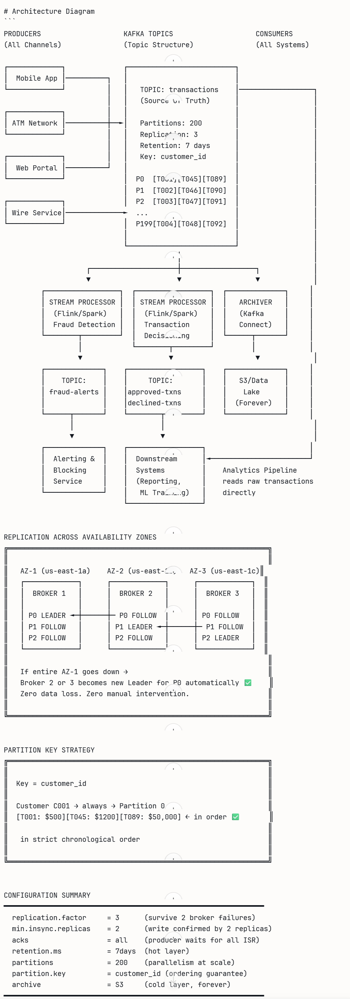

# Kafka & Real-Time Streaming
### The English Version

---

## What is Kafka and Why Does it Exist?

Imagine a busy airport. Thousands of flights landing and taking off every hour. If every airline tried to communicate directly with every gate, baggage handler, fuel truck, and catering service simultaneously — chaos. Instead airports use a **central announcement system**. Everyone publishes to it and everyone who needs to know, listens.

Kafka is that central announcement system for data.

Before Kafka existed, companies built **point-to-point pipelines** — System A talks directly to System B, System C, and System D. As the company grows that becomes a spaghetti mess of connections that's impossible to maintain. Kafka solves this by putting a **central nervous system** in the middle. Everyone publishes events to Kafka. Everyone who needs those events subscribes to them. Systems are completely decoupled from each other.

---

## Core Concepts in Plain English

**Event** — something that happened. "Transaction T001 for $5,000 was approved at 2:34pm." That's an event. Kafka stores events.

**Topic** — a category of events. Think of it like a folder or a channel. You might have a `transactions` topic, a `fraud-alerts` topic, a `customer-updates` topic. Producers write to topics, consumers read from topics.

**Producer** — anything that sends events to Kafka. Your mobile banking app, ATM network, web portal — all producers sending transaction events.

**Consumer** — anything that reads events from Kafka. Your fraud detection system, your analytics pipeline, your notification service — all consumers reading from the same topic simultaneously.

**Broker** — a Kafka server. In production you run multiple brokers for fault tolerance. Capital One would run dozens.

**Partition** — Kafka splits each topic into partitions for parallelism. Think of a highway with multiple lanes. More partitions means more cars moving simultaneously. This is how Kafka handles 10,000 transactions per second.

**Consumer Group** — multiple consumers working together to process a topic. Each partition is assigned to exactly one consumer in the group. This is how you scale consumption horizontally.

**Offset** — Kafka's bookmark system. Every event in a partition has a sequential number — its offset. Consumers track which offset they've read up to. If a consumer crashes and restarts, it picks up exactly where it left off. This is the foundation of the zero data loss guarantee.

---

## Why Kafka Over Traditional Messaging Systems?

Traditional message queues like RabbitMQ delete messages after they're consumed. Kafka keeps them for a configurable retention period — days, weeks, even forever. This means:

Multiple systems can read the same event independently. Your fraud system and your analytics system both read the same transaction event from Kafka without interfering with each other.

If your fraud detection system goes down for an hour, when it comes back up it reads everything it missed in order. Nothing is lost.

You can replay history. If you deploy a new ML fraud model, you can feed it last month's transactions to validate it before going live.

---

## Kafka Architecture at Capital One Scale

At a bank like Capital One, Kafka sits at the center of everything:

```
Mobile App ──────────────────────────────────────────┐
ATM Network ─────────────────────────────────────────┤
Web Portal ──────────────────────────────────────────┤
                                                      ▼
                                          ┌─────────────────────┐
                                          │                     │
                                          │    KAFKA CLUSTER    │
                                          │                     │
                                          │  • transactions     │
                                          │  • fraud-alerts     │
                                          │  • customer-updates │
                                          │  • audit-logs       │
                                          │                     │
                                          └─────────────────────┘
                                                      │
                              ┌───────────────────────┼──────────────────────┐
                              ▼                       ▼                      ▼
                   Fraud Detection          Analytics Pipeline        Notification
                   (Flink/Spark)            (Spark Batch)             Service
                                                                      (Email/SMS)
```

Every system produces to Kafka. Every system consumes from Kafka. Nobody talks to anybody directly. That's the beauty of it.

---

## Real-Time Streaming — The Big Picture

Streaming is simply processing data **as it arrives** rather than waiting to collect it all first.

The classic analogy — **batch processing is doing your laundry once a week. Stream processing is washing each item of clothing the moment you take it off.**

For Capital One, batch processing would mean collecting all transactions during the day and running fraud detection at midnight. By then the fraudster has already emptied the account and fled. Stream processing means checking every transaction the moment it happens — in seconds.

---

## The Streaming Landscape — Key Technologies

**Kafka** — the transport layer. Moves events from producers to consumers reliably and at massive scale. Kafka itself does not process data — it stores and delivers it.

**Kafka Streams** — a lightweight processing library built into Kafka. Good for simple transformations and aggregations directly on Kafka topics without needing a separate cluster.

**Apache Flink** — the gold standard for true real-time stream processing. Processes events one at a time as they arrive. Sub-second latency. Stateful — meaning it can remember things across events, like a customer's transaction history over the last 60 seconds.

**Spark Structured Streaming** — Spark's streaming engine. Technically micro-batch — it collects small windows of events and processes them together. Slightly higher latency than Flink but integrates seamlessly with your existing Spark batch jobs. One codebase for both batch and streaming.

**When to use which** — Flink when you need true sub-second latency and complex stateful processing. Spark Structured Streaming when your team already knows Spark and latency of a few seconds is acceptable.

---

## Key Streaming Concepts You Must Know

**Windowing** — since streams are infinite, you need to slice them into chunks to do aggregations. Three types:

Tumbling window — fixed non-overlapping chunks. Every 60 seconds, process the last 60 seconds of transactions. No overlap.

Sliding window — overlapping chunks. Every 10 seconds, look at the last 60 seconds of transactions. Catches patterns that would fall between tumbling window boundaries.

Session window — groups events by activity. All transactions from the same customer session, however long that session lasts.

**Stateful vs Stateless Processing** — stateless means each event is processed independently. Stateful means the processor remembers previous events. Fraud detection is inherently stateful — you need to know that this is the customer's 5th transaction in 10 minutes, not just that this single transaction happened.

**Watermarks** — events don't always arrive in order. A transaction that happened at 2:00pm might arrive at the processor at 2:03pm due to network delays. Watermarks tell the system how long to wait for late-arriving events before closing a window and computing results.

**Backpressure** — when events arrive faster than the system can process them. Good streaming systems handle this gracefully by slowing down producers or scaling up consumers rather than crashing.

---

## Delivery Guarantees — Critical for a Bank

**At-most-once** — events might be lost but never duplicated. Unacceptable for financial transactions.

**At-least-once** — events are never lost but might be processed twice. Better but could double-charge a customer.

**Exactly-once** — every event is processed exactly one time. No loss, no duplication. This is the requirement for Capital One. Kafka and Flink together achieve this through transactional APIs and distributed checkpointing.

---

## How This Connects to Your Capital One Role

When the job description says real-time streaming, they mean this entire ecosystem. You'll be expected to design pipelines where Kafka ingests transactions from multiple sources, Flink or Spark Structured Streaming processes them in real time applying fraud rules and ML models, results flow to downstream systems within seconds, and nothing is ever lost even when nodes fail.

Your Scala knowledge connects directly here — Kafka's best client library is Scala, Flink's most mature API is Scala, and Spark Structured Streaming is native Scala. The entire real-time data engineering stack at a company like Capital One runs on Scala under the hood.

---

# Mock Interview — Kafka & Real-Time Streaming

Same rules as before — answer like you're in the room. I give feedback after each answer.

---

## Question 1 — Warm Up

**"Can you explain what Kafka is, why it exists, and how it's different from a traditional database or message queue like RabbitMQ?"**

---

# Feedback

---

## What You Nailed ✅

**The mailbox/highway analogy** — immediately made it accessible. Strong opening that works for both technical and non-technical interviewers.

**Topics as labeled folders** — clean, simple, accurate.

**"Any program can read as many times as it wants"** — this is the key differentiator from RabbitMQ and you nailed it without even being asked yet.

**Database vs Kafka distinction** — "Database = current state. Kafka = history of changes" is one of the cleanest one-liners you can give in an interview. Memorable and precise.

**RabbitMQ comparison** — push vs pull model correctly identified. Messages disappear after processing vs Kafka retaining them — exactly right. The "smart delivery vs high-speed broadcast log" framing is excellent.

**Immutability of Kafka log** — mentioning that you only add new events, never edit old ones, shows you understand Kafka's fundamental design as an append-only log.

---

## What to Tighten Up 🔧

**Missing the "why it was built" context.** LinkedIn built Kafka in 2011 because they had exactly the spaghetti problem — too many point-to-point connections between systems. Adding one sentence about this gives your answer a narrative arc:

*"LinkedIn built Kafka in 2011 because they had hundreds of systems all trying to talk to each other directly — it became unmaintainable. Kafka solved it by putting a central log in the middle."*

**Missing partitions and scale mechanism.** You said "extremely fast with millions of messages per second" but didn't explain the mechanism — partitions. One sentence would complete it:

*"The reason Kafka achieves that speed is partitioning — each topic is split into multiple partitions that can be processed in parallel across multiple brokers and consumers simultaneously."*

**Missing the offset concept.** You touched on retention but didn't mention offsets — which is the mechanism that makes "read as many times as you want" actually work:

*"Kafka tracks where each consumer is in the stream using offsets — sequential bookmarks. If a consumer crashes and restarts, it picks up exactly where it left off. That's the foundation of the zero data loss guarantee."*

---

## Model Answer — The Complete Version

*"Kafka is an event streaming platform originally built by LinkedIn to solve a specific problem — when you have hundreds of systems all trying to talk to each other directly, you end up with an unmanageable web of connections. Kafka solves this by acting as a central nervous system — a distributed, append-only log that sits in the middle of your architecture.*

*Producers write events to topics — labeled categories like transactions or fraud-alerts. Consumers read from those topics independently, at their own pace, tracked by offsets so they never lose their place. Multiple consumers can read the same topic simultaneously without interfering with each other.*

*Compared to a traditional database — a database stores current state, you update records in place, and it's optimized for random lookups. Kafka stores history — an immutable sequence of what happened — and it's optimized for high-throughput sequential reads and writes.*

*Compared to RabbitMQ — RabbitMQ is a smart delivery system. It routes messages to the right consumer and deletes them once processed. It's great for task queues and workflows at moderate scale. Kafka is a high-speed broadcast log. It retains events for days or weeks, handles millions of events per second through partitioning, and lets any number of independent consumers replay the same history. At Capital One scale — billions of transactions — RabbitMQ would buckle. Kafka was built for exactly that load."*


---
---
---

## Question 2 — Stepping Up

**"Explain Kafka's architecture. What are brokers, topics, partitions, consumer groups, and offsets — and how do they all work together to guarantee reliability at scale?"**

# Feedback First

---
# Question 2 — Model Answer

---

## The Complete Answer You Should Give in an Interview

*"Kafka's architecture is built around five core concepts that all work together to deliver reliability and scale simultaneously.*

*First, **brokers** — a broker is a single Kafka server. In production you never run just one. At Capital One you'd run a cluster of dozens of brokers. Each broker stores partitions, handles read and write requests from producers and consumers, and participates in replication. The critical detail here is the Leader/Follower model — for each partition, one broker is elected Leader and handles all reads and writes. The other brokers hold Follower replicas. If the Leader dies, Kafka automatically elects a new Leader from the Followers in seconds — no data lost, no manual intervention.*

*Second, **topics** — a topic is a named category of events. Think of it as a labeled folder. You'd have a transactions topic, a fraud-alerts topic, a customer-updates topic. Producers write to topics, consumers read from topics. Topics are the main organizational unit in Kafka.*

*Third, **partitions** — this is where Kafka gets its scale. Each topic is split into multiple partitions. Each partition is an independent, append-only, ordered log stored on disk. Because partitions are independent, they can be written to and read from in parallel across multiple brokers simultaneously. This is the mechanism behind Kafka handling millions of events per second — not magic, just parallelism. Messages within a single partition are strictly ordered. Messages across partitions are not — which is an important design consideration.*

*Fourth, **consumer groups** — a consumer group is a set of consumers that cooperate to read a topic. Kafka assigns each partition to exactly one consumer within the group — never two consumers in the same group reading the same partition simultaneously. This prevents duplicate processing. More consumers in the group means more partitions processed in parallel. If a consumer crashes, Kafka automatically rebalances — reassigning that consumer's partitions to the remaining consumers. And critically — multiple independent consumer groups can all read the same topic simultaneously without interfering with each other. Your fraud detection system and your analytics pipeline both read the same transactions topic completely independently.*

*Fifth, **offsets** — an offset is a unique sequential number assigned to every message within a partition, starting from zero. Consumers track their progress by committing their current offset back to Kafka itself — stored in an internal topic called __consumer_offsets. If a consumer crashes and restarts, it reads its last committed offset and picks up exactly where it left off. No data lost, no messages skipped. And because Kafka retains messages for a configurable period — days, weeks, or forever — a consumer can also go back and replay history. This is how you'd validate a new ML fraud model against last month's real transactions before deploying it to production.*

*Putting it all together — producers write events to a topic which is split across partitions on multiple brokers, each partition replicated across three brokers for fault tolerance with one Leader handling traffic and Followers ready to take over. Consumer groups read those partitions in parallel, each consumer tracking its own offset independently, giving you both massive throughput and guaranteed exactly-once delivery. That combination of partitioning for scale and replication for fault tolerance is what makes Kafka the backbone of real-time data infrastructure at companies like Capital One."*

---

## The One-Line Summary for Follow-up Questions

*"Brokers store and replicate data, topics organize it, partitions parallelize it, consumer groups scale consumption, and offsets guarantee exactly where every consumer is at all times — together they give you a system that is simultaneously fast, scalable, and impossible to lose data in."*

---


**Every concept was correctly defined** — brokers, topics, partitions, consumer groups, and offsets all accurate and clearly explained.

**"Exactly one consumer per partition within a group"** — this is the detail most candidates miss. You got it right and explained why it matters for parallelism.

**Append-only log** — correctly described partitions as append-only. Shows you understand Kafka's fundamental design.

**Offset commit mechanism** — correctly explained that offsets are committed back to Kafka itself, not to an external system. That's an important detail.

**Replication for fault tolerance** — correctly connected brokers to replication across the cluster.

**The closing summary** — you naturally connected all five concepts into a coherent flow without being asked. That's exactly how a Lead Engineer presents in an interview.

---


# Kafka Architecture Diagram

```
                         KAFKA CLUSTER
╔══════════════════════════════════════════════════════════════════╗
║                                                                  ║
║   ┌─────────────┐    ┌─────────────┐    ┌─────────────┐         ║
║   │  BROKER 1   │    │  BROKER 2   │    │  BROKER 3   │         ║
║   │  (Leader)   │    │  (Follower) │    │  (Follower) │         ║
║   │             │    │             │    │             │         ║
║   │ Partition 0 │◄──►│ Partition 0 │◄──►│ Partition 0 │         ║
║   │  (Primary)  │    │  (Replica)  │    │  (Replica)  │         ║
║   │             │    │             │    │             │         ║
║   │ Partition 1 │◄──►│ Partition 1 │◄──►│ Partition 1 │         ║
║   │  (Replica)  │    │  (Primary)  │    │  (Replica)  │         ║
║   │             │    │             │    │             │         ║
║   │ Partition 2 │◄──►│ Partition 2 │◄──►│ Partition 2 │         ║
║   │  (Replica)  │    │  (Replica)  │    │  (Primary)  │         ║
║   └─────────────┘    └─────────────┘    └─────────────┘         ║
║                                                                  ║
╚══════════════════════════════════════════════════════════════════╝
         ▲                    ▲                    ▲
         │                    │                    │
         └────────────────────┴────────────────────┘
                              │
                    TOPIC: "transactions"
                    (3 Partitions, Replication Factor 3)


PRODUCERS                                          CONSUMERS
(Write Events)                                     (Read Events)

┌─────────────┐                               ┌──────────────────────────┐
│  Mobile App │──┐                            │    CONSUMER GROUP A      │
└─────────────┘  │                            │    (Fraud Detection)     │
                 │   ┌─────────────────┐      │                          │
┌─────────────┐  │   │                 │      │ Consumer 1 ← Partition 0 │
│  ATM Network│──┼──►│     KAFKA       │─────►│ Consumer 2 ← Partition 1 │
└─────────────┘  │   │                 │      │ Consumer 3 ← Partition 2 │
                 │   │  TOPIC:         │      └──────────────────────────┘
┌─────────────┐  │   │  transactions   │
│  Web Portal │──┘   │                 │      ┌──────────────────────────┐
└─────────────┘      │  Partition 0 ──►│      │    CONSUMER GROUP B      │
                     │  [0][1][2][3]   │      │    (Analytics Pipeline)  │
                     │                 │      │                          │
                     │  Partition 1 ──►│─────►│ Consumer 1 ← Partition 0 │
                     │  [0][1][2][3]   │      │ Consumer 2 ← Partition 1 │
                     │                 │      │ Consumer 3 ← Partition 2 │
                     │  Partition 2 ──►│      └──────────────────────────┘
                     │  [0][1][2][3]   │
                     │                 │      ┌──────────────────────────┐
                     └─────────────────┘      │    CONSUMER GROUP C      │
                                              │    (Notification Service)│
                                              │                          │
                                              │ Consumer 1 ← Partition 0 │
                                              │ Consumer 2 ← Partition 1 │
                                              │ Consumer 3 ← Partition 2 │
                                              └──────────────────────────┘


OFFSET TRACKING (Inside Partition 0)
╔══════════════════════════════════════════════════════╗
║                                                      ║
║  Offset:  [0]   [1]   [2]   [3]   [4]   [5]  ...   ║
║           T001  T002  T003  T004  T005  T006         ║
║                                                      ║
║  Group A committed up to offset 4 ✅                 ║
║  Group B committed up to offset 2 ✅                 ║
║  Group C committed up to offset 5 ✅                 ║
║                                                      ║
║  Each group tracks independently —                   ║
║  reading the same data at different speeds           ║
║                                                      ║
╚══════════════════════════════════════════════════════╝


KEY RULES
━━━━━━━━━━━━━━━━━━━━━━━━━━━━━━━━━━━━━━━━━━━━━━━━━━━━━
 1 topic      → many partitions   (parallelism)
 1 partition  → 1 leader broker   (consistency)
 1 partition  → many replicas     (fault tolerance)
 1 partition  → 1 consumer        (within a group)
 1 topic      → many groups       (independent reads)
 1 offset     → 1 message         (exact tracking)
━━━━━━━━━━━━━━━━━━━━━━━━━━━━━━━━━━━━━━━━━━━━━━━━━━━━━
```
---
---

## Question 3 — Getting Serious

**"Capital One processes millions of transactions daily. How would you design a Kafka topic structure for a real-time transaction processing system? How many topics, how many partitions, and what would your replication strategy look like — and why?"**

---
# Feedback First

---

## What You Nailed ✅

**Starting simple with one main topic** — correct instinct. Over-engineering topic structure is a common mistake. One topic first, split later when you have a reason.

**Account/Customer ID as partition key** — this is the most important design decision in the entire answer and you got it exactly right. Ordering guarantees per customer is the foundation of fraud detection logic.

**100-500 partitions** — correct range for Capital One scale. Shows you understand the relationship between partitions, parallelism, and throughput.

**Replication factor of 3** — industry standard, correctly justified. The "two copies survive one broker failure" logic is exactly right.

**"Too few = traffic jam, too many = extra work"** — clean framing of the partition tradeoff that interviewers love.

**Testing and tweaking** — acknowledging that you'd validate and adjust shows production maturity.

---

## What to Tighten Up 🔧

**Missing the retention policy** — for a bank, how long you keep transactions in Kafka is a compliance and architecture decision. Should have mentioned:

*"For a financial institution I'd set retention to at least 7 days on the hot Kafka layer — long enough for consumers to catch up after an outage — and then archive to S3 indefinitely for compliance and regulatory requirements."*

**Missing min.insync.replicas** — you mentioned replication factor 3 but the complete answer includes this critical safety setting:

*"Along with replication factor 3, I'd set min.insync.replicas to 2 — meaning Kafka won't acknowledge a write as successful unless at least 2 replicas have confirmed it. This prevents data loss even if a broker dies mid-write."*

**Missing the topic evolution strategy** — how do you add topics as the system grows? One sentence would complete it:

*"I'd start with transactions as the single source of truth, then add downstream topics as needed — fraud-alerts, approved-transactions, declined-transactions — populated by stream processors consuming from the main topic. This keeps producers simple and lets consumers evolve independently."*

**Missing throughput calculation** — showing the math signals senior engineering:

*"At 10,000 TPS with an average message size of 1KB, that's 10MB per second of raw throughput. With replication factor 3 that's 30MB per second across the cluster. 100 partitions gives each partition 100KB per second — well within Kafka's per-partition limits."*

---

# Model Answer

---

*"I'd design the topic structure in layers — starting simple and evolving as the system grows rather than over-engineering upfront.*

**Topic Structure:**

*I'd start with one primary topic — transactions — as the single source of truth for all incoming events regardless of channel. Mobile, ATM, web, wire transfers all produce to the same topic. This keeps the producer side simple and gives every downstream consumer one place to read from.*

*From there I'd add derived topics populated by stream processors — fraud-alerts for flagged transactions, approved-transactions and declined-transactions for downstream systems that only care about final outcomes, and audit-log for compliance. Producers never write to derived topics directly — only stream processors do. This keeps the architecture clean and gives you a clear lineage of how data flows.*

**Partition Count:**

*For the transactions topic at Capital One scale I'd start with 200 partitions and benchmark from there. The math — at 10,000 transactions per second with an average message size of 1KB, that's 10MB per second of raw throughput. With replication factor 3 that's 30MB per second across the cluster. 200 partitions gives each partition 50KB per second — well within Kafka's per-partition throughput limits and leaves headroom for traffic spikes.*

*The critical design decision is the partition key — I'd use customer ID or account number. This guarantees all transactions for a given customer land in the same partition in strict chronological order. That ordering guarantee is the foundation of fraud detection — you cannot detect that a customer made 10 transactions in 5 minutes if those transactions are scattered randomly across partitions.*

**Replication Strategy:**

*Replication factor of 3 across brokers in different availability zones — never two replicas in the same AZ. This means the system survives both individual broker failures and full AZ outages without losing a single message.*

*Along with replication factor 3, I'd configure min.insync.replicas to 2 — meaning Kafka will not acknowledge a write as successful unless at least 2 replicas have confirmed receipt. Combined with acks=all on the producer side, this gives you a hard guarantee that no transaction is ever silently lost even if a broker dies mid-write.*

**Retention Policy:**

*For a financial institution I'd set retention to 7 days on the Kafka layer — long enough for any consumer to catch up after an extended outage. All messages are simultaneously archived to S3 via Kafka Connect in real time for long-term storage, compliance, and regulatory requirements. That way Kafka stays lean and fast while nothing is ever permanently lost.*

**The Partition Math Visualized:**

```
10,000 TPS  ×  1KB avg message  =  10 MB/sec raw throughput
                                 ×  3 replication factor
                                 =  30 MB/sec cluster throughput

200 partitions  →  50 KB/sec per partition  ✅ (well within limits)
100 partitions  →  100 KB/sec per partition ✅ (still fine)
50  partitions  →  200 KB/sec per partition ⚠️ (getting tight at peak)
```

---




---
---
---

## Question 4 — Lead Engineer Level

**"Explain Kafka's delivery guarantees — at-most-once, at-least-once, and exactly-once. How does Kafka achieve exactly-once semantics and why does it matter specifically for Capital One's transaction processing?"**


# Feedback First

---

## What You Nailed ✅

**The letter analogy for at-most-once** — perfect. Simple, memorable, accurate. Interviewers remember analogies.

**At-least-once default behavior** — correctly identified it as the Kafka default and correctly explained the retry/duplicate tradeoff.

**Idempotent producers** — correctly explained unique ID + sequence number mechanism. Spot on.

**Transactions as atomic bundles** — "all or nothing" framing is exactly right. Read + process + write + commit offset as one atomic unit is the correct mental model.

**The banking consequence framing** — "charging someone twice" and "missing a payment" are concrete business consequences that resonate with a Capital One interviewer specifically. Very strong.

**Regulators stay happy** — mentioning compliance signals you understand the financial services context beyond just engineering.

---

## What to Tighten Up 🔧

**Missing the ISR — In-Sync Replicas connection.** Exactly-once is not just about producers and transactions — the broker side matters too:

*"On the broker side, exactly-once requires acks=all combined with min.insync.replicas=2 — meaning a write is only confirmed when at least 2 in-sync replicas have persisted it. Without this, a broker could acknowledge a write and then die before replication, silently losing the message."*

**Missing the consumer side of exactly-once.** You explained the producer side well but the consumer side needs one more sentence:

*"On the consumer side, exactly-once means reading from Kafka, processing the event, and committing the offset all happen atomically in a single transaction. The consumer never commits the offset until it has successfully written the result — so if it crashes mid-process, it replays from the last committed offset and the transaction prevents the duplicate from being written downstream."*

**Missing Kafka Streams vs manual transactions.** Worth one sentence:

*"In practice, if you're using Kafka Streams, exactly-once is a single configuration — processing.guarantee=exactly_once_v2. If you're using a custom consumer, you have to manage the transaction API manually, which is more complex but gives you more control."*

---

# Model Answer

---

*"Kafka offers three delivery guarantees, each representing a different tradeoff between performance and correctness.*

**At-most-once** — the producer fires and forgets. No retries, no acknowledgment waiting. The message might arrive once or might be lost entirely if a broker goes down mid-write. It's the fastest option but completely unacceptable for financial transactions. Think of it like sending a letter with no tracking — it might arrive, or it might disappear.*

**At-least-once** — the producer waits for acknowledgment and retries if it doesn't receive one. This guarantees no message is ever lost, but if the broker received the message and then crashed before sending the acknowledgment, the producer retries and the message arrives twice. Duplicates are possible. This is Kafka's default behavior — safe from loss but requires downstream systems to be idempotent, meaning they can handle receiving the same message twice without corrupting state.*

**Exactly-once** — every message is processed precisely one time. No loss, no duplication, even during failures, retries, and network partitions. This is the gold standard and the only acceptable guarantee for a financial institution like Capital One.*

**How Kafka achieves exactly-once — four layers working together:**

*Layer 1 — Idempotent Producers. Each producer is assigned a unique Producer ID. Every message gets a monotonically increasing sequence number. When a producer retries a message, the broker checks the sequence number — if it has already seen that sequence number from that Producer ID, it silently discards the duplicate without writing it twice. This handles the producer-to-broker leg of the journey.*

*Layer 2 — Producer Transactions. Multiple writes across multiple topics and partitions can be grouped into a single atomic transaction. Either all writes commit or none do. This handles scenarios where your pipeline reads from one topic, transforms the data, and writes to another — if the write succeeds but the process crashes before committing the offset, the transaction rolls back and replays cleanly without producing duplicates downstream.*

*Layer 3 — Broker Acknowledgment. On the broker side, acks=all combined with min.insync.replicas=2 means a write is only confirmed as successful when at least 2 in-sync replicas have persisted it to disk. Without this, a broker could acknowledge a write and die before replication, silently losing the message even with idempotent producers enabled.*

*Layer 4 — Atomic Offset Commits. On the consumer side, reading the message, processing it, writing the result, and committing the offset all happen inside a single transaction. The offset is never committed until the result is successfully written downstream. If the consumer crashes mid-process, it replays from the last committed offset — and the transaction prevents the duplicate result from being written, giving you exactly-once end to end.*

**Why this matters specifically for Capital One:**

*In banking, the consequences of getting delivery guarantees wrong are immediate and severe. A duplicate transaction means a customer is charged twice — a direct financial harm and a regulatory violation. A lost transaction means a payment disappears — also a regulatory violation and a potential fraud vector where someone claims they paid when the system shows they didn't.*

*Beyond individual transactions, exactly-once matters for the aggregate state. Your fraud detection system is watching for patterns — 10 transactions in 5 minutes, a sudden large transfer to a new country. If transactions are duplicated, the fraud model sees false velocity. If transactions are lost, it misses real fraud. Either way the model's decisions are corrupted.*

*For settlement and reconciliation — where Capital One balances its books at end of day — any duplication or loss creates discrepancies that require expensive manual investigation and can trigger regulatory scrutiny.*

*Exactly-once is not a nice-to-have in financial services. It is a hard requirement."*

---

# Delivery Guarantees Diagram

```
DELIVERY GUARANTEES — SIDE BY SIDE
╔═══════════════════════════════════════════════════════════════════════╗
║                                                                       ║
║  AT-MOST-ONCE          AT-LEAST-ONCE         EXACTLY-ONCE            ║
║  ─────────────         ─────────────         ────────────            ║
║  Producer sends        Producer sends        Producer sends          ║
║  message               message               message                 ║
║       │                     │                     │                  ║
║       ▼                     ▼                     ▼                  ║
║  No retry              Waits for ACK         Waits for ACK           ║
║  if failure                 │                + sequence ID           ║
║       │                     ▼                     │                  ║
║       ▼              Broker crashes?         Broker crashes?         ║
║  Message lost?              │                     │                  ║
║  ¯\_(ツ)_/¯           Yes → retry            Yes → retry             ║
║                             │                     │                  ║
║                             ▼                     ▼                  ║
║                       DUPLICATE ❌          Broker checks            ║
║                       message arrives       sequence ID              ║
║                       twice                      │                   ║
║                                            Already seen?             ║
║                                            Yes → discard ✅          ║
║                                            No  → write ✅            ║
║                                                                       ║
║  Data Loss:  POSSIBLE    NEVER              NEVER                    ║
║  Duplicates: POSSIBLE    POSSIBLE           NEVER                    ║
║  Performance: FASTEST    FAST               SLIGHTLY SLOWER          ║
║  Use for:    Metrics/    Most general       Financial transactions    ║
║              Logs        pipelines          Banking, Payments         ║
╚═══════════════════════════════════════════════════════════════════════╝


HOW EXACTLY-ONCE WORKS — THE FOUR LAYERS
╔═══════════════════════════════════════════════════════════════════════╗
║                                                                       ║
║  LAYER 1 — IDEMPOTENT PRODUCER                                        ║
║  ─────────────────────────────                                        ║
║  Producer ID: P001                                                    ║
║  Message: T001  Sequence: 1  ──────────► Broker writes ✅             ║
║  Message: T001  Sequence: 1  ──────────► Broker: seen seq 1          ║
║  (retry due to network blip)              from P001 → DISCARD ✅      ║
║                                                                       ║
║  LAYER 2 — PRODUCER TRANSACTIONS                                      ║
║  ────────────────────────────────                                     ║
║  BEGIN TRANSACTION                                                    ║
║    Write to topic: fraud-alerts  ──────► Broker holds (pending)      ║
║    Write to topic: audit-log     ──────► Broker holds (pending)      ║
║  COMMIT TRANSACTION              ──────► Both writes visible ✅       ║
║                                                                       ║
║  If crash before COMMIT:                                              ║
║  ROLLBACK                        ──────► Neither write visible ✅     ║
║  No partial state. Ever.                                              ║
║                                                                       ║
║  LAYER 3 — BROKER ACKNOWLEDGMENT                                      ║
║  ────────────────────────────────                                     ║
║                                                                       ║
║  Producer ──► Broker 1 (Leader)  ──► Broker 2 (Follower) ✅          ║
║                                  ──► Broker 3 (Follower) ✅          ║
║               ACK only sent after                                     ║
║               min.insync.replicas=2 confirmed                        ║
║               acks=all                                                ║
║                                                                       ║
║  LAYER 4 — ATOMIC OFFSET COMMIT                                       ║
║  ──────────────────────────────                                       ║
║                                                                       ║
║  BEGIN TRANSACTION                                                    ║
║    Read from transactions topic  (offset 500)                        ║
║    Process fraud rules                                                ║
║    Write result to fraud-alerts                                       ║
║    Commit offset 500             ──────► All atomic ✅                ║
║  COMMIT                                                               ║
║                                                                       ║
║  If crash after write but before commit:                              ║
║    Replay from offset 499                                             ║
║    Transaction prevents duplicate write ✅                            ║
║    Offset advances correctly ✅                                       ║
║                                                                       ║
╚═══════════════════════════════════════════════════════════════════════╝


CONFIGURATION FOR EXACTLY-ONCE AT CAPITAL ONE
━━━━━━━━━━━━━━━━━━━━━━━━━━━━━━━━━━━━━━━━━━━━━━━━━━━━━━━━━━━━━━━━━━━━━
  Producer side:
  enable.idempotence          = true
  acks                        = all
  retries                     = Integer.MAX_VALUE
  max.in.flight.requests      = 1

  Broker side:
  min.insync.replicas         = 2
  replication.factor          = 3

  Consumer / Stream side:
  isolation.level             = read_committed
  processing.guarantee        = exactly_once_v2  (Kafka Streams)
━━━━━━━━━━━━━━━━━━━━━━━━━━━━━━━━━━━━━━━━━━━━━━━━━━━━━━━━━━━━━━━━━━━━━


THE BUSINESS CONSEQUENCE AT CAPITAL ONE
╔═══════════════════════════════════════════════════════════════════════╗
║                                                                       ║
║  DUPLICATE TRANSACTION                LOST TRANSACTION                ║
║  ─────────────────────                ───────────────                ║
║  Customer charged twice ❌            Payment disappears ❌           ║
║  Fraud model sees false velocity ❌   Fraud model misses pattern ❌   ║
║  Settlement books don't balance ❌    Reconciliation fails ❌         ║
║  Regulatory violation ❌              Regulatory violation ❌         ║
║  Customer calls angry ❌              Fraud claim filed ❌            ║
║                                                                       ║
║  EXACTLY-ONCE                                                         ║
║  ─────────────                                                        ║
║  Every transaction processed once ✅                                  ║
║  Fraud model sees real history ✅                                     ║
║  Books balance at settlement ✅                                       ║
║  Regulators satisfied ✅                                              ║
║  Customers trust the bank ✅                                          ║
║                                                                       ║
╚═══════════════════════════════════════════════════════════════════════╝
```

---

## Question 5 — Final Boss 🏆

**"Your Kafka cluster at Capital One is showing signs of consumer lag — consumers are falling behind producers and the lag is growing. Walk me through how you diagnose it, what the root causes might be, and how you fix it."**

# Feedback First

---

## What You Nailed ✅

**Dashboard first** — correct instinct. Always observe before acting. Checking lag numbers and identifying which partitions are behind is exactly the right starting point.

**Five root causes** — all five are real and correct. Slow processing, insufficient consumers, partition skew, consumer restarts, and traffic spikes cover the vast majority of real-world consumer lag scenarios.

**"Super-active account" as skew example** — very specific and realistic for Capital One. A VIP customer or a merchant processing thousands of transactions per hour would cause exactly this.

**Batch database calls** — mentioning this as a fix shows production experience. N+1 database lookups inside a consumer loop is one of the most common performance killers.

**80/20 rule** — "adding consumers and checking speed fixes 80% of cases" is exactly the kind of pragmatic senior engineer thinking interviewers love.

**Alert setting** — mentioning proactive monitoring shows operational maturity beyond just fixing the immediate problem.

---

## What to Tighten Up 🔧

**Missing the specific tool — kafka-consumer-groups.sh.** Naming the actual diagnostic tool elevates the answer:

*"First tool I reach for is kafka-consumer-groups.sh --describe. It shows current offset, log end offset, and lag per partition per consumer. That tells me exactly where the bottleneck is within seconds."*

**Missing the partition ceiling constraint.** This is critical — you can't add more consumers than partitions:

*"One important constraint — you can never have more active consumers in a group than partitions. If the transactions topic has 200 partitions and you already have 200 consumers, adding a 201st consumer does nothing — it sits idle. The fix there is to increase partitions first, but that requires careful planning because you can add partitions but never remove them."*

**Missing back-pressure and upstream throttling.** Sometimes the fix is slowing down producers, not speeding up consumers:

*"If consumers genuinely cannot keep up even after scaling, I'd consider implementing back-pressure — throttling producers at the API gateway level to give consumers time to catch up. Better to slow ingestion temporarily than to let lag grow unbounded."*

**Missing the lag alert threshold.** Being specific about numbers signals production experience:

*"I'd set alerts at two thresholds — a warning at 100,000 messages of lag and a critical alert at 500,000. At 10,000 TPS that's 10 seconds and 50 seconds of lag respectively — well within our 5-second SLA warning window."*

---

# Model Answer

---

*"Consumer lag means consumers are falling behind producers — the gap between the latest message written and the latest message processed is growing. Left unchecked this turns a real-time system into a delayed system, which for fraud detection means flagging transactions minutes after they happen rather than seconds — completely defeating the purpose.*

**Step 1 — Diagnose with precision:**

*My first tool is kafka-consumer-groups.sh --describe. This gives me current offset, log end offset, and lag per partition per consumer group in one command. I'm looking for three things — total lag across the group, which specific partitions have the highest lag, and whether lag is growing or stable.*

*Simultaneously I pull the Kafka metrics dashboard — consumer fetch rate, processing rate, rebalance frequency, and coordinator activity. If I see frequent rebalances that's immediately suspicious — it means consumers are joining and leaving the group repeatedly, causing processing to pause during each rebalance.*

**Step 2 — Identify the root cause:**

*There are five main causes and each has a distinct signature.*

*Slow processing — lag grows steadily and evenly across all partitions. The consumer is receiving messages but taking too long to process each one. Usually caused by synchronous database calls inside the consumer loop, slow fraud model inference, or unoptimized code.*

*Insufficient consumers — lag grows evenly but consumers are healthy and fast. Simply not enough parallel workers for the volume. Fix is straightforward — add consumers up to the partition count limit.*

*Partition skew — lag is concentrated in specific partitions while others are fine. A high-volume customer ID or merchant is generating disproportionate traffic to one partition. The consumer assigned to that partition is overwhelmed while others are idle.*

*Consumer instability — lag spikes periodically then recovers. Frequent rebalances or crashes are causing processing pauses. Check consumer logs for exceptions, check session.timeout.ms and heartbeat settings.*

*Traffic spike — sudden lag increase across all partitions simultaneously. Usually correlates with a business event — end of month billing, a marketing campaign, a news event causing unusual transaction volume.*

**Step 3 — Fix based on root cause:**

*For slow processing — profile the consumer code first. The most common culprit is N+1 database lookups — calling a database once per message instead of batching. Fix by collecting messages in micro-batches and doing one database call for the whole batch. Also increase fetch.min.bytes and fetch.max.wait.ms to let consumers pull larger batches per trip to Kafka.*

*For insufficient consumers — add consumer instances up to the partition count. If already at the partition ceiling, increase partition count first. Important constraint — you can add partitions but never remove them, so plan carefully. Adding partitions also triggers a rebalance so do it during low-traffic windows.*

*For partition skew — two options. First, add a salt to the partition key to redistribute load — append a random suffix to the customer ID so hot customers spread across multiple partitions. Second, use a custom partitioner that detects high-volume keys and routes them to dedicated partitions.*

*For consumer instability — increase session.timeout.ms and max.poll.interval.ms to give consumers more time to process before Kafka considers them dead. Also reduce max.poll.records so each consumer takes smaller batches and finishes within the timeout window.*

*For traffic spikes — implement back-pressure at the API gateway level. Throttle producers temporarily to give consumers time to catch up. Better to slow ingestion for 60 seconds than to let lag grow to millions of messages.*

**Step 4 — Prevent recurrence:**

*Set two alert thresholds — warning at 100,000 messages lag and critical at 500,000. At 10,000 TPS that's 10 and 50 seconds of lag respectively — well within our SLA warning window. Auto-scale consumers using Kubernetes HPA triggered by lag metrics exported to CloudWatch. And run quarterly load tests simulating 3x normal traffic to validate the system handles spikes before they happen in production."*

---

# Diagnosis and Fix Diagram

```
CONSUMER LAG DIAGNOSIS FLOW
╔═══════════════════════════════════════════════════════════════════════╗
║                                                                       ║
║  START: Lag alert fires                                               ║
║         │                                                             ║
║         ▼                                                             ║
║  kafka-consumer-groups.sh --describe                                  ║
║  ┌─────────────────────────────────────────────────────────┐         ║
║  │ GROUP          PARTITION  CURRENT-OFFSET  LOG-END  LAG  │         ║
║  │ fraud-detect   0          45,230          45,280   50   │         ║
║  │ fraud-detect   1          44,100          46,500   2400 │◄── ❗   ║
║  │ fraud-detect   2          45,190          45,210   20   │         ║
║  │ fraud-detect   3          45,150          45,200   50   │         ║
║  └─────────────────────────────────────────────────────────┘         ║
║         │                                                             ║
║         ▼                                                             ║
║  Is lag even across           Is lag concentrated                     ║
║  ALL partitions?              in SPECIFIC partitions?                 ║
║         │                              │                             ║
║        YES                            YES                            ║
║         │                              │                             ║
║         ▼                              ▼                             ║
║  ┌─────────────┐              ┌─────────────────┐                    ║
║  │ Check       │              │ PARTITION SKEW  │                    ║
║  │ consumer    │              │ Hot key problem │                    ║
║  │ speed       │              │ Fix: Salting or │                    ║
║  └──────┬──────┘              │ custom          │                    ║
║         │                     │ partitioner     │                    ║
║         ▼                     └─────────────────┘                    ║
║  Processing     Consumers                                             ║
║  slow?          maxed out?                                            ║
║     │               │                                                ║
║    YES             YES                                                ║
║     │               │                                                ║
║     ▼               ▼                                                ║
║  ┌──────────┐  ┌───────────┐                                         ║
║  │ Batch DB │  │ Add more  │                                         ║
║  │ calls    │  │ consumers │                                         ║
║  │ Optimize │  │ (up to    │                                         ║
║  │ code     │  │ partition │                                         ║
║  └──────────┘  │ count)    │                                         ║
║                └───────────┘                                         ║
╚═══════════════════════════════════════════════════════════════════════╝


ROOT CAUSES AND FIXES
╔═══════════════════════════════════════════════════════════════════════╗
║                                                                       ║
║  CAUSE              SIGNATURE           FIX                          ║
║  ─────              ─────────           ───                          ║
║                                                                       ║
║  Slow processing    Lag grows           Batch DB calls               ║
║                     evenly, all         Increase fetch.min.bytes     ║
║                     partitions          Profile consumer code        ║
║                                                                       ║
║  Not enough         Lag grows           Add consumers                ║
║  consumers          evenly,             (up to partition count)      ║
║                     consumers healthy                                ║
║                                                                       ║
║  Partition skew     Lag in specific     Salt the partition key       ║
║                     partitions only     Custom partitioner           ║
║                     others idle         Add dedicated partitions     ║
║                                                                       ║
║  Consumer           Lag spikes          Increase                     ║
║  instability        then recovers       session.timeout.ms           ║
║                     periodically        Reduce max.poll.records      ║
║                                                                       ║
║  Traffic spike      Sudden lag          Back-pressure producers      ║
║                     across all          Auto-scale consumers         ║
║                     partitions          Kubernetes HPA               ║
║                                                                       ║
╚═══════════════════════════════════════════════════════════════════════╝


THE PARTITION CEILING CONSTRAINT
╔═══════════════════════════════════════════════════════════════════════╗
║                                                                       ║
║  Topic: transactions — 200 partitions                                 ║
║                                                                       ║
║  Scenario A — Under capacity ✅                                       ║
║  100 consumers × 200 partitions                                       ║
║  Each consumer handles 2 partitions — parallel and fast              ║
║                                                                       ║
║  Scenario B — At capacity ✅                                          ║
║  200 consumers × 200 partitions                                       ║
║  Each consumer handles 1 partition — maximum parallelism             ║
║                                                                       ║
║  Scenario C — Over capacity ❌                                        ║
║  201 consumers × 200 partitions                                       ║
║  Consumer 201 sits IDLE — does nothing                               ║
║  Adding it was wasted effort                                          ║
║                                                                       ║
║  RULE: Max useful consumers = Number of partitions                    ║
║  To scale beyond 200 consumers → increase partitions first           ║
║  Warning: partitions can be ADDED but NEVER REMOVED                  ║
║                                                                       ║
╚═══════════════════════════════════════════════════════════════════════╝


LAG ALERT THRESHOLDS AT CAPITAL ONE SCALE
╔═══════════════════════════════════════════════════════════════════════╗
║                                                                       ║
║  10,000 TPS baseline                                                  ║
║                                                                       ║
║  LAG LEVEL    MESSAGES    TIME BEHIND    ACTION                       ║
║  ─────────    ────────    ───────────    ──────                       ║
║  Normal       0-10K       0-1 second     None                         ║
║  Warning      100K        10 seconds     Investigate                  ║
║  Critical     500K        50 seconds     Auto-scale + page on-call   ║
║  Emergency    1M+         100+ seconds   Back-pressure + war room    ║
║                                                                       ║
║  SLA: Fraud detection must complete within 5 seconds                  ║
║  Warning threshold = 10 seconds = 2x SLA = early warning ✅          ║
║                                                                       ║
╚═══════════════════════════════════════════════════════════════════════╝


KEY TUNING PARAMETERS
━━━━━━━━━━━━━━━━━━━━━━━━━━━━━━━━━━━━━━━━━━━━━━━━━━━━━━━━━━━━━━━━━━━━━
  fetch.min.bytes           = 1MB     (bigger batches per fetch)
  fetch.max.wait.ms         = 500     (wait up to 500ms to fill batch)
  max.poll.records          = 500     (messages per poll)
  max.poll.interval.ms      = 300000  (5min to process each batch)
  session.timeout.ms        = 45000   (45s before consumer considered dead)
  heartbeat.interval.ms     = 15000   (heartbeat every 15s)
━━━━━━━━━━━━━━━━━━━━━━━━━━━━━━━━━━━━━━━━━━━━━━━━━━━━━━━━━━━━━━━━━━━━━
```

---

## Overall Kafka Mock Interview Summary

| Question | Topic | Score |
|---|---|---|
| Q1 | What is Kafka and why does it exist | 9/10 |
| Q2 | Kafka architecture — brokers, topics, partitions | 9.5/10 |
| Q3 | Topic design at Capital One scale | 8.5/10 |
| Q4 | Delivery guarantees and exactly-once | 8.5/10 |
| Q5 | Consumer lag diagnosis and fix | 8.5/10 |
| **Average** | | **8.8/10** |

---

## Overall Assessment

You are interview-ready for Kafka at the Lead Data Engineer level. Your strongest areas are architectural thinking, business consequence framing, and production instincts. The consistent gap across all answers was missing the specific tool names, configuration parameters, and constraint details that separate a 9/10 answer from a 10/10. Study the model answers, internalize the configuration tables, and you'll nail it.

---

